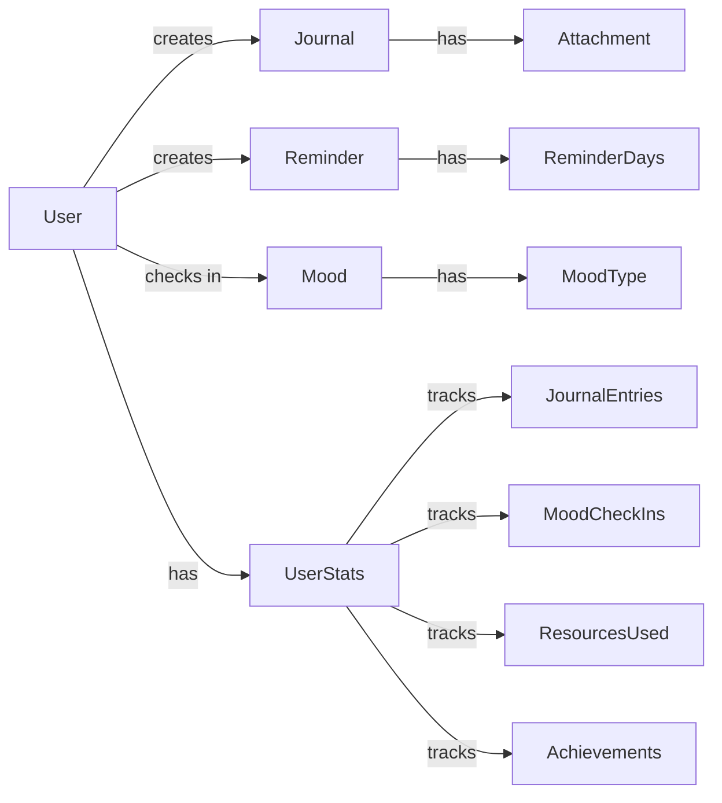
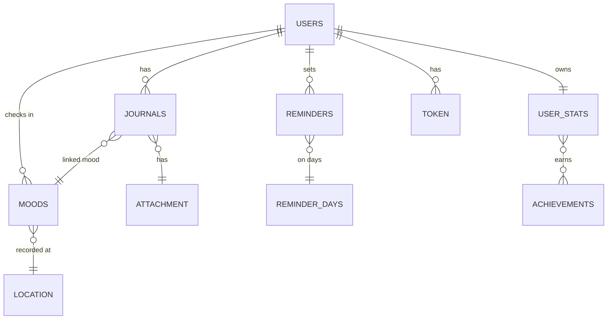
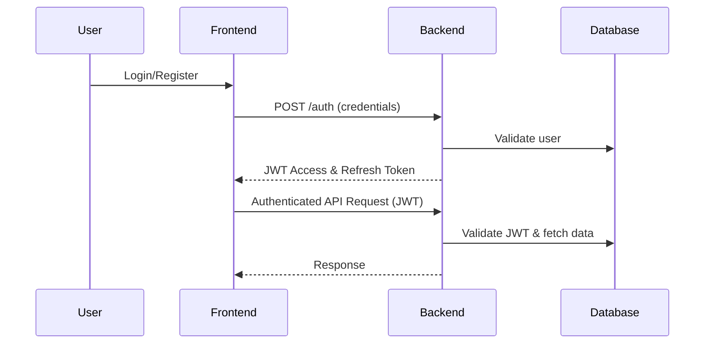

# Calm Pulses Backend

<p align="center">
  
  
  
  
  
  
</p>

---

## 🏗️ High-Level Architecture



---

## 🗄️ Database ER Diagram



---

## 🔐 Security Flow (JWT Authentication)



---

## 🗃️ Database Schema (Main Entities)

- **User** (`users`):
  - id (UUID, PK)
  - name, email, password, avatarURL, phoneNumber, address
  - joinedDate, lastLogin, lastUpdated, role
- **Journal** (`journals`):
  - id (PK), prompt, mood (FK), title, description, attachment, createdAt, user (FK)
- **Mood** (`moods`):
  - id (PK), moodType, value, note, timeStamp, location, user (FK)
- **Reminder** (`reminders`):
  - id (PK), title, time, days, enabled, lastTriggered, user (FK)
- **UserStats** (`user_stats`):
  - id (PK), journalEntries, moodCheckIns, resourcesUsed, averageMood, longestStreak, currentStreak, level, achievement, user (FK)
- **Token** (`token`):
  - id (PK), token, tokenType, revoked, expired, user (FK)

---

## 🛡️ Security Mechanism

- **Authentication:** JWT-based, stateless sessions
- **Authorization:** Role-based (USER, ADMIN), method-level security
- **Password Storage:** BCrypt hashing
- **Token Management:** Access & refresh tokens, token revocation
- **Spring Security** with custom filters and providers

---

## 🚀 Technical Stack

- **Language:** Java 17
- **Framework:** Spring Boot 3.x
- **Database:** MySQL 8+
- **ORM:** Spring Data JPA (Hibernate)
- **Security:** Spring Security, JWT
- **API Docs:** OpenAPI/Swagger
- **Validation:** Jakarta Validation
- **Mapping:** ModelMapper
- **Build Tool:** Gradle

---

## ⚙️ Installation Guide

1. **Clone the repository:**
   ```powershell
   git clone https://github.com/sanketp1/calm-pulse-backend.git
   cd calm-puleses-backend
   ```
2. **Configure Database:**
   - Update `src/main/resources/application.yml` with your MySQL credentials if needed.
3. **Build the project:**
   ```powershell
   ./gradlew build
   ```
4. **Run the application:**
   ```powershell
   ./gradlew bootRun
   ```
5. **API Documentation:**
   - Visit [http://localhost:8080/swagger-ui.html](http://localhost:8080/swagger-ui.html) after starting the server.

---

## Made by Sanket with ❤️
